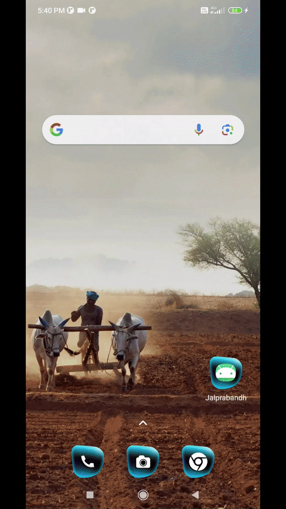

## Final year projects

This repo consist of code for my academic project that I have done in my final year.
This is a enhanced smart irrigation model using IOT, and it can be implement very effeciently for varrying crop fields.
Some more information can be found in these [slides](smart_irrigation_slides.pdf)

## Tech stacks

- Java - Application Development
- Python - Script for Resberi Pi
- Cpp - Script to transmit and recieve data among nodes
- Arduino - To communicate between nodes
- Firebase - to upload the field data
- Resberi Pi - to cummunicate with cloud

## Demonstration

- [@Pranav108](https://github.com/Pranav108/) 🙋‍♂️
